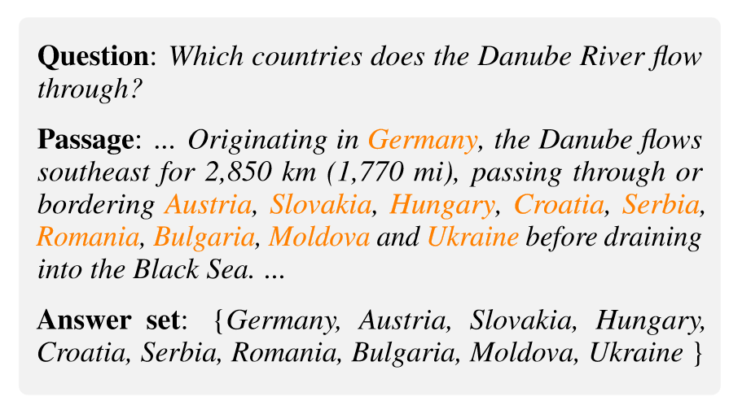
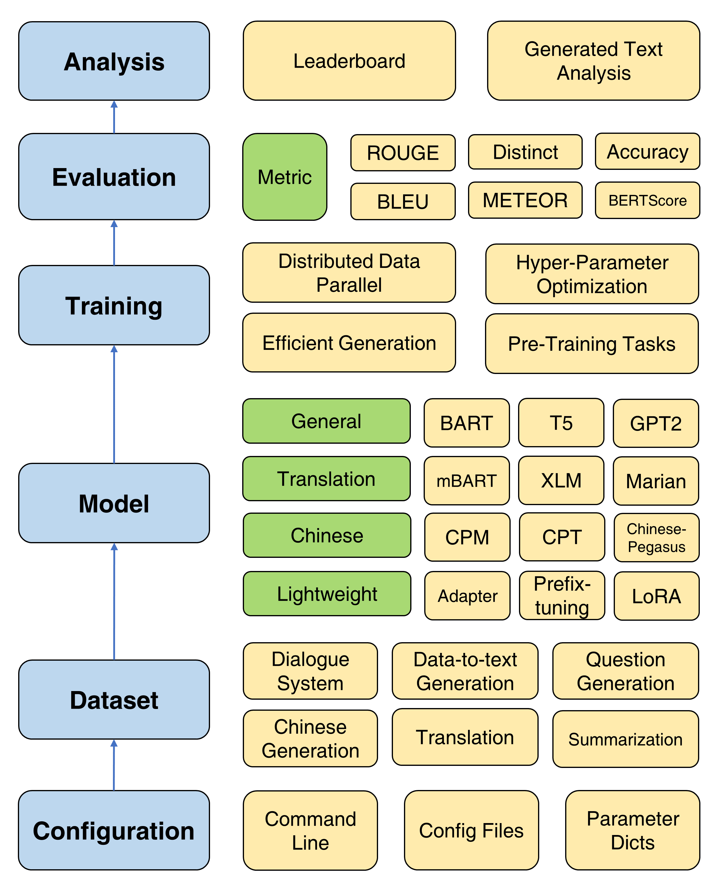

<h1 align="center">NLPVault</h1>

    Contributed by 
    <a href="https://github.com/Geaming-CHN">Geaming</a>

---

- [Introduction](#introduction)
- [Papers](#papers)
  - [Agent](#agent)
  - [Benchmark](#benchmark)
  - [Code](#code)
  - [CoT](#cot)
  - [Data Construction](#data-construction)
  - [Data Leakage](#data-leakage)
  - [In Context Learning](#in-context-learning)
  - [Interpretability](#interpretability)
  - [Model](#model)
  - [Others](#others)
  - [Post-training](#post-training)
  - [Prompt Engineering](#prompt-engineering)
  - [Reasoning LLMs](#reasoning-llms)
  - [Reforcement Learning](#reforcement-learning)
  - [Retrieval Augmented Generation](#retrieval-augmented-generation)
  - [Safety, Security and Privacy](#safety-security-and-privacy)
    - [A. Safety](#a-safety)
    - [B. Security](#b-security)
    - [C. Privacy](#c-privacy)
  - [Self Reflection](#self-reflection)
  - [Technical Report](#technical-report)
  - [Text Generation](#text-generation)
- [Models](#models)
- [Datasets](#datasets)
  - [Text Classificaton](#text-classificaton)
  - [Sequence Labeling](#sequence-labeling)
  - [Machine Translation](#machine-translation)
  - [Question Answering](#question-answering)
    - [Multiple-Choice Question Answering](#multiple-choice-question-answering)
    - [Open-Domain Question Answering](#open-domain-question-answering)
    - [Multi-span Question Answering](#multi-span-question-answering)
    - [Factoid Question Answering](#factoid-question-answering)
  - [Text Summarization](#text-summarization)
  - [Text Generation](#text-generation-1)
- [Metrics and Benchmarks](#metrics-and-benchmarks)
  - [Metircs](#metircs)
  - [Benchmarks](#benchmarks)
- [Tools \& Libraries](#tools--libraries)
  - [Labeling Tools](#labeling-tools)
  - [Python Package](#python-package)
  - [Others](#others-1)
- [Tutorials \& Guides](#tutorials--guides)
  - [Leaderboards](#leaderboards)
- [Resources](#resources)
- [Projects](#projects)

---

## Introduction

参考了[[Awesome-Story-Generation](https://github.com/yingpengma/Awesome-Story-Generation)]所搭建的自己的 NLP 资料仓库。主要聚焦于 NLP 的 LLM 及其在各个领域中的应用。因为是由我自己整理的资料，可能存在错误，欢迎大家随意提 PR 或者 issue。

与我联系：`jm.li4@siat.ac.cn`

---

## Papers

**_NLP 各个领域论文链接 link，在每个领域中按照主题，年份进行排序，_**😎

- ：表示还没读过
- ：表示泛读
- ：表示细读

Eg. `ACL-2023` **Title** [paper] [code] .. [authors]]()

### Agent

- `arXiv-2024` **Swe-agent: Agent-computer interfaces enable automated software engineering** [[paper](https://arXiv.org/abs/2405.15793)][[code](https://princeton-nlp.github.io/SWE-agent/)][J Yang, CE Jimenez, A Wettig, K Lieret, S Yao…]

### Benchmark

- `arXiv-2023` **Instruction-following evaluation for large language models** [[paper](https://arxiv.org/abs/2311.07911)][[code](https://github.com/google-research/google-research/tree/master/instruction_following_eval)][J Zhou, T Lu, S Mishra, S Brahma, S Basu…]

- `ACL-2023` **WikiHowQA: A Comprehensive Benchmark for Multi-Document Non-Factoid Question Answering** [[paper](https://aclanthology.org/2023.acl-long.290/)][[code](https://lurunchik.github.io/WikiHowNFQA/)][V Bolotova-Baranova, V Blinov…]

- `TACL-2022` **LOT: A story-centric benchmark for evaluating Chinese long text understanding and generation** [[paper](https://direct.mit.edu/tacl/article-abstract/doi/10.1162/tacl_a_00469/110537)][[code](https://github.com/thu-coai/LOT-LongLM)][J Guan, Z Feng, Y Chen, R He, X Mao, C Fan…]

- `ACL-2022` **TruthfulQA: Measuring how models mimic human falsehoods** [[paper](https://arXiv.org/abs/2109.07958)][[code](https://github.com/sylinrl/TruthfulQA)][S Lin, J Hilton, O Evans]

### Code

- `arXiv-2024` **TestBench: Evaluating Class-Level Test Case Generation Capability of Large Language Models** [[paper](https://arxiv.org/abs/2409.17561)][Q Zhang, Y Shang, C Fang, S Gu, J Zhou…]

- `axXiv-2024` **Evaluating and aligning codellms on human preference** [[paper](https://arxiv.org/abs/2412.05210)][[code]()][J Yang, J Yang, K Jin, Y Miao, L Zhang, L Yang…]

- `arXiv-2024` **ExecRepoBench: Multi-level Executable Code Completion Evaluation** [[paper](https://arxiv.org/abs/2412.11990)][[code](https://execrepobench.github.io/)][J Yang, J Zhang, J Yang, K Jin, L Zhang…]

- `FSE-2024` **No more manual tests? evaluating and improving chatgpt for unit test generation** [[paper](https://arxiv.org/abs/2305.04207)][[code](https://github.com/FudanSELab/ChatTester/tree/main)][Z Yuan, Y Lou, M Liu, S Ding, K Wang, Y Chen…]

- `FSE-2024` **On the Evaluation of Large Language Models in Unit Test Generation** [[paper](https://dl.acm.org/doi/abs/10.1145/3691620.3695529)][[code](https://github.com/ZJU-ACES-ISE/ChatUniTest)][L Yang, C Yang, S Gao, W Wang, B Wang…]

- `ASE-2024` **On the Evaluation of Large Language Models in Unit Test Generation** [[paper](https://dl.acm.org/doi/abs/10.1145/3691620.3695529)][L Yang, C Yang, S Gao, W Wang, B Wang…]

- `arXiv-2024` **Opencodeinterpreter: Integrating code generation with execution and refinement** [[paper](https://arXiv.org/abs/2402.14658)][[code](https://opencodeinterpreter.github.io/)][T Zheng, G Zhang, T Shen, X Liu, BY Lin, J Fu…]

- `ICLR-2024` **Swe-bench: Can language models resolve real-world github issues?** [[paper](https://arXiv.org/abs/2310.06770)][[code]()][CE Jimenez, J Yang, A Wettig, S Yao, K Pei…]

- `ICLR-2024` **Repobench: Benchmarking repository-level code auto-completion systems** [[paper](https://arXiv.org/abs/2306.03091)][[code]()][T Liu, C Xu, J McAuley]

- `Neurips-2023` **Crosscodeeval: A diverse and multilingual benchmark for cross-file code completion** [[paper](https://proceedings.neurips.cc/paper_files/paper/2023/hash/920f2dced7d32ab2ba2f1970bc306af6-Abstract-Datasets_and_Benchmarks.html)][[code](https://crosscodeeval.github.io/)][Y Ding, Z Wang, W Ahmad, H Ding…]

### CoT

- `arXiv-2023` **Chain-of-verification reduces hallucination in large language models** [[paper](https://arXiv.org/abs/2309.11495)][S Dhuliawala, M Komeili, J Xu, R Raileanu, X Li…]

- `ACL-2023 findings` **Towards reasoning in large language models: A survey** [[paper](https://arXiv.org/abs/2212.10403)][[code](https://github.com/jeffhj/LM-reasoning)][J Huang, KCC Chang]

- `ACL-2023` **Interleaving retrieval with chain-of-thought reasoning for knowledge-intensive multi-step questions** [[paper](https://arXiv.org/abs/2212.10509)][[code](https://github.com/stonybrooknlp/ircot)][H Trivedi, N Balasubramanian, T Khot…]

- `ICLR-2023` **Automatic chain of thought prompting in large language models** [[paper](https://arXiv.org/abs/2210.03493)][[code](https://github.com/amazon-science/auto-cot)][Z Zhang, A Zhang, M Li, A Smola]

- `NeurIPS-2022` **Chain-of-thought prompting elicits reasoning in large language models** [[paper](https://proceedings.neurips.cc/paper_files/paper/2022/hash/9d5609613524ecf4f15af0f7b31abca4-Abstract-Conference.html)][J Wei, X Wang, D Schuurmans…]

- `arXiv-2025` **O1-Pruner: Length-Harmonizing Fine-Tuning for O1-Like Reasoning Pruning** [[paper](https://arxiv.org/abs/2501.12570)][[code](https://github.com/StarDewXXX/O1-Pruner)][H Luo, L Shen, H He, Y Wang, S Liu, W Li…]

- `arXiv-2025` **CoT-Valve: Length-Compressible Chain-of-Thought Tuning** [[paper](https://arxiv.org/abs/2502.09601)][X Ma, G Wan, R Yu, G Fang, X Wang]

### Data Construction

- `ACL-2024` **Self-Distillation Bridges Distribution Gap in Language Model Fine-Tuning** [[paper](https://arXiv.org/abs/2402.13669)][[code](https://github.com/sail-sg/sdft)][Z Yang, Q Liu, T Pang, H Wang, H Feng, M Zhu…]

- `ICLR-2024` **Alpagasus: Training a better alpaca with fewer data** [[paper](https://arXiv.org/abs/2307.08701)][[code](https://github.com/Lichang-Chen/AlpaGasus)][L Chen, S Li, J Yan, H Wang, K Gunaratna…]

- `ICLR-2024` **What makes good data for alignment? a comprehensive study of automatic data selection in instruction tuning** [[paper](https://arXiv.org/abs/2312.15685)][[code]()][W Liu, W Zeng, K He, Y Jiang, J He]

- `arXiv-2024` **Clustering and Ranking: Diversity-preserved Instruction Selection through Expert-aligned Quality Estimation** [[paper](https://arXiv.org/abs/2402.18191)][[code]()][Y Ge, Y Liu, C Hu, W Meng, S Tao, X Zhao…]

- `arXiv-2024` **Less: Selecting influential data for targeted instruction tuning** [[paper](https://arXiv.org/abs/2402.04333)][[code](https://github.com/princeton-nlp/LESS)][M Xia, S Malladi, S Gururangan, S Arora…]

- `NAACL-2023` **From quantity to quality: Boosting llm performance with self-guided data selection for instruction tuning** [[paper](https://arXiv.org/abs/2308.12032)][[code](https://github.com/tianyi-lab/Cherry_LLM)][M Li, Y Zhang, Z Li, J Chen, L Chen, N Cheng…]

- `arXiv-2023` **One shot learning as instruction data prospector for large language models** [[paper](https://arXiv.org/abs/2312.10302)][[code](https://github.com/pldlgb/nuggets)][Y Li, B Hui, X Xia, J Yang, M Yang, L Zhang…]

- `arXiv-2023` **Instruction mining: When data mining meets large language model finetuning** [[paper](https://arXiv.org/abs/2307.06290][[code]()][Y Cao, Y Kang, C Wang, L Sun]

- `Neurips-2023` **Lima: Less is more for alignment** [[paper](https://proceedings.neurips.cc/paper_files/paper/2023/file/ac662d74829e4407ce1d126477f4a03a-Paper-Conference.pdf)][[code]()][C Zhou, P Liu, P Xu, S Iyer, J Sun…]

- `ACL-2023` **Self-instruct: Aligning language models with self-generated instructions** [[paper](https://arXiv.org/abs/2212.10560)][[code](https://github.com/yizhongw/self-instruct)][Y Wang, Y Kordi, S Mishra, A Liu, NA Smith…]

### Data Leakage

- `EMNLP-2024` **Pretraining Data Detection for Large Language Models: A Divergence-based Calibration Method** [[paper](https://arxiv.org/abs/2409.14781)][[code](https://github.com/zhang-wei-chao/DC-PDD )][W Zhang, R Zhang, J Guo, M de Rijke, Y Fan…]

### In Context Learning

- `arXiv-2024` **Many-shot in-context learning** [[paper](https://arxiv.org/abs/2404.11018)][R Agarwal, A Singh, LM Zhang, B Bohnet…]

### Interpretability

- `arXiv-2024` **Do I Know This Entity? Knowledge Awareness and Hallucinations in Language Models** [[paper](https://arxiv.org/abs/2411.14257)][J Ferrando, O Obeso, S Rajamanoharan…]

- `arXiv-2024` **Scaling and evaluating sparse autoencoders** [[paper](https://arxiv.org/abs/2406.04093)][[code](https://github.com/openai/sparse_autoencoder)][L Gao, TD la Tour, H Tillman, G Goh, R Troll…]

### Model

- `arXiv-2023` **Advancing Transformer Architecture in Long-Context Large Language Models: A Comprehensive Survey** [[paper](https://arXiv.org/abs/2311.12351)][[code](https://github.com/Strivin0311/long-llms-learning)][Y Huang, J Xu, Z Jiang, J Lai…]

- `arXiv-2023` **A survey on long text modeling with transformers** [[paper](https://arXiv.org/abs/2302.14502)][Z Dong, T Tang, L Li, WX Zhao]

### Others

- `arXiv-2023` **R-tuning: Teaching large language models to refuse unknown questions** [[paper](https://arXiv.org/abs/2311.09677)][[code](https://github.com/shizhediao/R-Tuning)][H Zhang, S Diao, Y Lin, YR Fung, Q Lian…]

- `arXiv-2023` **Lost in the middle: How language models use long contexts** [[paper](https://arXiv.org/abs/2307.03172)][NF Liu, K Lin, J Hewitt, A Paranjape…]

### Post-training

- `EMNLP-2021` **Raise a child in large language model: Towards effective and generalizable fine-tuning** [[paper](https://arxiv.org/abs/2109.05687)][R Xu, F Luo, Z Zhang, C Tan, B Chang…]

### Prompt Engineering

- `arXiv-2023` **Principled Instructions Are All You Need for Questioning LLaMA-1/2, GPT-3.5/4** [[paper](https://arXiv.org/abs/2312.16171)][[code](https://github.com/VILA-Lab/ATLAS)][S Bsharat, A Myrzakhan, Z Shen]

### Reasoning LLMs

- `arXiv-2025` **From System 1 to System 2: A Survey of Reasoning Large Language Models** [[paper](https://arxiv.org/abs/2502.17419)][[code](https://github.com/zzli2022/Awesome-System2-Reasoning-LLM)][ZZ Li, D Zhang, ML Zhang, J Zhang, Z Liu…]

### Reforcement Learning

- `arXiv-2025` **Deepseek-r1: Incentivizing reasoning capability in llms via reinforcement learning** [[paper](https://arxiv.org/abs/2501.12948)][[code]()][D Guo, D Yang, H Zhang, J Song, R Zhang…]

### Retrieval Augmented Generation

- `arXiv-2024` **Reliable, Adaptable, and Attributable Language Models with Retrieval** [[paper](https://arXiv.org/abs/2403.03187)][[code]()][A Asai, Z Zhong, D Chen, PW Koh…]

- `CAIN-2024` **Seven Failure Points When Engineering a Retrieval Augmented Generation System** [[paper](https://arXiv.org/abs/2401.05856)][[code](https://figshare.com/s/fbf7805b5f20d7f7e356)][S Barnett, S Kurniawan, S Thudumu…]

- `ICLR-2023` **Copy is all you need** [[paper](https://arXiv.org/abs/2307.06962)][[code](https://github.com/gmftbyGMFTBY/Copyisallyouneed)][T Lan, D Cai, Y Wang, H Huang, XL Mao]

- `arXiv-2023` **Learning to Filter Context for Retrieval-Augmented Generation** [[paper](https://arXiv.org/abs/2311.08377)][[code](https://github.com/zorazrw/filco)][Z Wang, J Araki, Z Jiang, MR Parvez…]

- `arXiv-2023` **Self-RAG: Learning to Retrieve, Generate, and Critique through Self-Reflection** [[paper](https://arXiv.org/abs/2310.11511)][[code](https://selfrag.github.io/)][A Asai, Z Wu, Y Wang, A Sil, H Hajishirzi]

- `arXiv-2023` **A Step Closer to Comprehensive Answers: Constrained Multi-Stage Question Decomposition with Large Language Models** [[paper](https://arXiv.org/abs/2311.07491)][[code](https://github.com/alkaidpku/DQ-ToolQA)][H Cao, Z An, J Feng, K Xu, L Chen, D Zhao]

- `arXiv-2023` **Chain-of-Note: Enhancing Robustness in Retrieval-Augmented Language Models** [[paper](https://arXiv.org/abs/2311.09210)][W Yu, H Zhang, X Pan, K Ma, H Wang, D Yu]

- `arXiv-2023` **KNN-LM Does Not Improve Open-ended Text Generation** [[paper](https://arXiv.org/abs/2305.14625)][S Wang, Y Song, A Drozdov, A Garimella…]

- `arXiv-2023` **Replug: Retrieval-augmented black-box language models** [[paper](https://arXiv.org/abs/2301.12652)][W Shi, S Min, M Yasunaga, M Seo, R James…]

- `arXiv-2023` **Rethinking with retrieval: Faithful large language model inference** [[paper](https://arXiv.org/abs/2301.00303)][[code](https://github.com/HornHehhf/RR)][H He, H Zhang, D Roth]

- `ICLR-2023` **Generate rather than retrieve: Large language models are strong context generators** [[paper](https://arXiv.org/abs/2209.10063)][[code](https://github.com/wyu97/GenRead)][W Yu, D Iter, S Wang, Y Xu, M Ju, S Sanyal…]

- `arXiv-2022` **Atlas: Few-shot learning with retrieval augmented language models** [[paper](https://arXiv.org/abs/2208.03299)][[code](https://github.com/facebookresearch/atlas)][G Izacard, P Lewis, M Lomeli, L Hosseini…]

- `EMNLP-2022` **Training language models with memory augmentation** [[paper](https://arXiv.org/abs/2205.12674)][[code](https://github.com/princeton-nlp/TRIME)][Z Zhong, T Lei, D Chen]

- `NeurIPS-2021` **End-to-end training of multi-document reader and retriever for open-domain question answering** [[paper](https://proceedings.neurips.cc/paper_files/paper/2021/hash/da3fde159d754a2555eaa198d2d105b2-Abstract.html)][[code](https://github.com/DevSinghSachan/emdr2)][D Singh, S Reddy, W Hamilton…]

- `NeurIPS-2020` **Retrieval-augmented generation for knowledge-intensive nlp tasks** [[paper](https://proceedings.neurips.cc/paper/2020/hash/6b493230205f780e1bc26945df7481e5-Abstract.html)][P Lewis, E Perez, A Piktus, F Petroni…]

- `ICLR-2020` **Generalization through memorization: Nearest neighbor language models** [[paper](https://arXiv.org/abs/1911.00172)][U Khandelwal, O Levy, D Jurafsky…]

- `ICML-2020` **Retrieval augmented language model pre-training** [[paper](http://proceedings.mlr.press/v119/guu20a.html?ref=https://githubhelp.com)][K Guu, K Lee, Z Tung, P Pasupat…]

- `ACL-2019` **Latent retrieval for weakly supervised open domain question answering** [[paper](https://arXiv.org/abs/1906.00300)][K Lee, MW Chang, K Toutanova]

### Safety, Security and Privacy

推荐仓库：[**LM-SSP**](https://github.com/ThuCCSLab/lm-ssp)
，SSP 下结构与 LM-SSP 保持一致，只是不再区分小类。

#### A. Safety

- `ICLR-2024` **Gpt-4 is too smart to be safe: Stealthy chat with llms via cipher** [[paper](https://arXiv.org/abs/2308.06463)][[code](https://github.com/RobustNLP/CipherChat)][Y Yuan, W Jiao, W Wang, J Huang, P He, S Shi…]

- `NAACL-2024` **A Wolf in Sheep's Clothing: Generalized Nested Jailbreak Prompts can Fool Large Language Models Easily** [[paper](https://arXiv.org/abs/2311.08268)][[code](https://github.com/NJUNLP/ReNeLLM)][P Ding, J Kuang, D Ma, X Cao, Y Xian, J Chen…]

- `arXiv-2024` **DrAttack: Prompt Decomposition and Reconstruction Makes Powerful LLM Jailbreakers** [[paper](https://arXiv.org/abs/2402.16914)][[code](https://github.com/xirui-li/DrAttack)][X Li, R Wang, M Cheng, T Zhou, CJ Hsieh]

- `arXiv-2023` **Universal and transferable adversarial attacks on aligned language models** [[paper](https://arXiv.org/abs/2307.15043)][[code](https://github.com/llm-attacks/llm-attacks)][A Zou, Z Wang, JZ Kolter, M Fredrikson]

#### B. Security

#### C. Privacy

### Self Reflection

- `Neurips-2023` **Reflexion: Language agents with verbal reinforcement learning** [[paper](https://proceedings.neurips.cc/paper_files/paper/2023/hash/1b44b878bb782e6954cd888628510e90-Abstract-Conference.html)][[code](https://github.com/noahshinn/reflexion)][N Shinn, F Cassano, A Gopinath…]

- `EMNLP-2023` **Large language models can self-improve** [[paper](https://arXiv.org/abs/2210.11610)][J Huang, SS Gu, L Hou, Y Wu, X Wang, H Yu…]

### Technical Report

- `arXiv-2024` **Phi-4 Technical Report** [[paper](https://arxiv.org/abs/2412.08905)][[code]()][M Abdin, J Aneja, H Behl, S Bubeck, R Eldan…]

### Text Generation

- `ACL-2023` **Doc: Improving long story coherence with detailed outline control** [[paper](https://arXiv.org/abs/2212.10077)][[code](https://github.com/yangkevin2/doc-story-generation)][K Yang, D Klein, N Peng, Y Tian]

- `ACL-2023` **STORYWARS: A Dataset and Instruction Tuning Baselines for Collaborative Story Understanding and Generation** [[paper](https://arXiv.org/abs/2305.08152)][[code](https://github.com/ylndu/storywars)][Y Du, L Chilton]

  - P.S. 论文中附的代码仓库链接已经 404，试图和作者取得联系(2023/11/20 15:30)。

- `arXiv-2023` **Retrieval meets Long Context Large Language Models** [[paper](https://arXiv.org/abs/2310.03025)][P Xu, W Ping, X Wu, L McAfee, C Zhu, Z Liu…]

- `NeurIPS-2022` **Factuality enhanced language models for open-ended text generation** [[paper](https://proceedings.neurips.cc/paper_files/paper/2022/hash/df438caa36714f69277daa92d608dd63-Abstract-Conference.html)][[code](https://github.com/nayeon7lee/FactualityPrompt)][N Lee, W Ping, P Xu, M Patwary…]

- `EMNLP-2022` **Re3: Generating longer stories with recursive reprompting and revision** [[paper](https://arXiv.org/abs/2210.06774)][[code](https://github.com/yangkevin2/emnlp22-re3-story-generation)][K Yang, Y Tian, N Peng, D Klein]

- `arXiv-2021` **Automatic story generation: Challenges and attempts** [[paper](https://arXiv.org/abs/2102.12634)][A Alabdulkarim, S Li, X Peng]

- `ACL-2021` **Long Text Generation by Modeling Sentence-Level and Discourse-Level Coherence** [[paper](https://arXiv.org/abs/2105.08963)][[code](https://github.com/thu-coai/HINT)][J Guan, X Mao, C Fan, Z Liu, W Ding, M Huang]

- `AAAI-2021` **Automated storytelling via causal, commonsense plot ordering** [[paper](https://ojs.aaai.org/index.php/AAAI/article/view/16733)][[code](https://github.com/rajammanabrolu/C2PO)][P Ammanabrolu, W Cheung, W Broniec…]

- `CIKM-2020` **Creative Storytelling with Language Models and Knowledge Graphs** [[paper](http://ceur-ws.org/Vol-2699/paper07.pdf)][[code](https://github.com/ranyxr/dice_story)][X Yang, I Tiddi]

- `AAAI-2019` **Plan-and-write: Towards better automatic storytelling** [[paper](https://ojs.aaai.org/index.php/AAAI/article/view/4726)][[code](https://bitbucket.org/VioletPeng/language-model)][L Yao, N Peng, R Weischedel, K Knight…]

---

## Models

**_NLP 模型和算法_**

---

## Datasets

**_常用 NLP 数据集链接和描述_**

[汇总表格](https://geaming-chn.github.io/NLPVault/Datasets.html)

### Text Classificaton

### Sequence Labeling

### Machine Translation

### Question Answering

#### Multiple-Choice Question Answering

- **CommonsenseQA**

  多项选择问答数据集，需要不同类型的常识知识来预测正确答案。它包含 12,102 个问题，包括一个正确答案和四个干扰答案。

- **Social IQA**

  Social Interaction QA，这是一种用于测试社会常识性智力的新问答基准。与许多先前专注于物理或分类知识的基准相反，社会智商侧重于对人们的行为及其社会影响的推理。例如，给定一个像“杰西看了一场音乐会”这样的动作和一个像“杰西为什么要这样做？”这样的问题，人类可以很容易地推断出杰西想“看他们最喜欢的表演者”或“欣赏音乐”，而不是“看看里面发生了什么”或“看看它是否有效”。Social IQa 中的操作涵盖各种社交情境，答案候选者既包含人工策划的答案，也包含对抗性过滤的机器生成的候选者。Social IQa 包含超过 37,000 个 QA 对，用于评估模型推理日常事件和情境的社会影响的能力。

- **CosmosQA**

  Cosmos QA 是一个包含 35.6K 个问题的大型数据集，这些问题要求以常识为基础的阅读理解，并以多项选择题的形式出现。它侧重于阅读人们日常叙述的字里行间，提出的问题涉及事件的可能原因或影响，需要在上下文的确切文本跨度之外进行推理。

#### Open-Domain Question Answering

- **Natural Questions**

  NQ 语料库包含来自真实用户的问题，它要求 QA 系统阅读和理解整篇维基百科文章，该文章可能包含也可能不包含问题的答案。包含真实的用户问题。许多参与者只想使用提取的文本，因此我们还提供了仅 4GB 的训练数据的简化版本，完整的数据集为 42GB 。

- **OpenBookQA**

  OpenBookQA 是一种新型的问题解答数据集，它仿照用于评估人类对某一学科理解的开卷考试。该数据集由 5957 道小学科学选择题组成（4957 道训练题、500 道设计题、500 道测试题），用于探究对一小本包含 1326 个核心科学事实的 "书 "的理解，以及将这些事实应用于新情况的能力。在训练中，数据集包括从每个问题到其旨在探究的核心科学事实的映射。回答 OpenBookQA 的问题需要额外的广泛常识，而这些常识并不包含在书中。

- **TruthfulQA**

  提出了基准来衡量语言模型在生成问题答案时是否真实。该基准包括 817 个问题，涵盖 38 个类别，包括健康、法律、金融和政治。我们精心设计了一些问题，有些人会因为错误的信念或误解而错误地回答这些问题。为了表现良好，模型必须避免产生通过模仿人类文本而获得的错误答案。

- **BioASQ-QA**

  BioASQ-QA：生物医学问答的手动整理语料库

#### Multi-span Question Answering

- **MultiSpanQA**

  多跨度问题，即答案是文本中一系列多个不连续跨度的问题，在现实生活中很常见，但研究较少。在本文中，我们介绍了 MultiSpanQA1，这是一个专注于多跨度答案问题的新数据集。原始问题和上下文是从自然问题（Kwiatkowski 等人，2019 年）数据集中提取的。

    

#### Factoid Question Answering

### Text Summarization

### Text Generation

- **Writing Prompts**

  收集了一个包含 300K 个人工编写故事的大型数据集，并配以来自在线论坛的写作提示。我们的数据集支持分层故事生成，其中模型首先生成一个前提，然后将其转换为一段文本。

---

## Metrics and Benchmarks

**_一些 NLP 评价指标_**

### Metircs

- **Perplexity (PPL)**

  Perplexity is a measure of uncertainty in the value of a sample from a discrete probability distribution. The larger the perplexity, the less likely it is that an observer can guess the value which will be drawn from the distribution.

- **Bilingual Evaluation Understudy (BLEU)**

  An algorithm for evaluating the quality of text which has been machine-translated from one natural language to another. Quality is considered to be the correspondence between a machine's output and that of a human: "the closer a machine translation is to a professional human translation, the better it is" – this is the central idea behind BLEU.

  > **Bleu: a method for automatic evaluation of machine translation** [[paper](https://aclanthology.org/P02-1040.pdf)][K Papineni, S Roukos, T Ward…]

### Benchmarks

---

## Tools & Libraries

**_NLP 工具和库_**

### Labeling Tools

- [**RLHF-Label-Tool**](https://github.com/SupritYoung/RLHF-Label-Tool)

  RLHF 标注工具 是一个简单易用的，可以在大模型进行 RLHF（基于人类反馈的强化学习）标注排序的工具，旨在帮助用户在友好的图形界面中对生成式模型生成的答案进行排序标注。

- [**label-studio**](https://github.com/HumanSignal/label-studio)

  Label Studio 是一个开源数据标签工具。它允许您使用简单明了的 UI 标记音频、文本、图像、视频和时间序列等数据类型，并导出为各种模型格式。它可用于准备原始数据或改进现有训练数据，以获得更准确的 ML 模型。

### Python Package

- [**NLTK**](https://www.nltk.org/)

  NLTK 是一个领先的平台，用于构建 Python 程序以处理人类语言数据。它为 50 多个语料库和词汇资源（如 WordNet）提供了易于使用的界面，以及一套用于分类、标记化、词干提取、标记、解析和语义推理的文本处理库、工业级 NLP 库的包装器，以及一个活跃的讨论论坛。

- [**LangChain**](https://www.langchain.com/)

  LangChain 是一个基于语言模型开发应用程序的框架。它可以实现以下应用程序：

  - 上下文感知：将语言模型连接到上下文源（提示指令、few-shot，内容以使其响应为基础等）
  - 原因：依靠语言模型进行推理（关于如何根据提供的上下文回答、采取什么行动等）

  该框架由几个部分组成

  - LangChain：Python 和 JavaScript 库。包含无数组件的接口和集成，将这些组件组合成链和代理的，以及链和代理的实现
  - LangChain Templates：一组易于部署的参考架构，适用于各种任务
  - LangServe：用于将 LangChain 部署为 REST API 的库
  - LangSmith：一个开发者平台，可以调试、测试、评估和监控基于 LLM 框架构建的链，并于 LangChain 无缝集成

- [**TextBox 2.0 (妙笔)**](https://github.com/RUCAIBox/TextBox)

  TextBox 2.0 是一个基于 Python 和 PyTorch 的最新文本生成库，专注于构建一个统一和标准化的管道，用于将预训练的语言模型应用于文本生成。

    

- [**DeepSpeed**](https://github.com/microsoft/DeepSpeed)

  DeepSpeed 支持世界上最强大的语言模型，如 MT-530B 和 BLOOM。它是一款易于使用的深度学习优化软件套件，可为训练和推理提供前所未有的规模和速度。

### Others

- [**OpenCompass**](https://opencompass.org.cn/) ([GitHub](https://github.com/open-compass/opencompass/tree/main))

  OpenCompass 能够帮助你穿越评估大型语言模型的重重迷雾。OpenCompass 提供丰富的算法和功能支持，期待 OpenCompass 能够帮助社区更便捷地对 NLP 模型的性能进行公平全面的评估。

- [**Codabench**](https://www.codabench.org/)([GitHub](https://github.com/codalab/codabench))

  Codabench 是一个基于 Web 的开源平台，使研究人员、开发人员和数据科学家能够协作，目标是推进使用机器学习和高级计算的研究领域。Codabench 通过其在线社区帮助解决面向数据的研究领域的许多常见问题，人们可以在其中共享工作表并参加竞赛和基准测试。它可以看作是 CodaLab Competitions 的 2 版本。

- [**BELLE**](https://github.com/LianjiaTech/BELLE)

  本项目的目标是促进中文对话大模型开源社区的发展，愿景是成为能够帮到每一个人的 LLM Engine。

  相比如何做好大语言模型的预训练，BELLE 更关注如何在开源预训练大语言模型的基础上，帮助每一个人都能够得到一个属于自己的、效果尽可能好的具有指令表现能力的语言模型，降低大语言模型、特别是中文大语言模型的研究和应用门槛。为此，BELLE 项目会持续开放指令训练数据、相关模型、训练代码、应用场景等，也会持续评估不同训练数据、训练算法等对模型表现的影响。BELLE 针对中文做了优化，模型调优仅使用由 ChatGPT 生产的数据（不包含任何其他数据）。

- [**OpenAI Evals**](https://github.com/openai/evals)

  评估提供了一个框架，用于评估大型语言模型 （LLMs） 或使用 LLMs.我们提供了一个现有的评估注册表，用于测试不同维度的 OpenAI 模型，并能够为您关心的用例编写自己的自定义评估。您还可以使用您的数据来构建私有评估值，这些评估值表示工作流中的常见 LLMs 模式，而无需公开任何数据。

- [**CRUD-RAG**](https://github.com/IAAR-Shanghai/CRUD_RAG/tree/main)

  全面支持中文 RAG Benchmark 评测，包括原生的中文数据集、评测任务、主流基座测试；覆盖 CRUD(增删改查)，即大模型信息新增能力、信息缩减能力、信息校正能力、信息查询问答能力全方位评测；总测试数据量达到 36166 个，为中文 RAG 测试最多；多个指标类型覆盖，包括 ROUGE, BLEU, bertScore, RAGQuestEval，一键评估；

## Tutorials & Guides

**_NLP 入门和高级教程_**

### Leaderboards

LLMs 榜单，方便筛选性能优异模型或是追踪新出的模型

- [OpenCompass Leaderboard](https://opencompass.org.cn/leaderboard-llm)

---

## Resources

**_其他资源，包括但不限于会议视频、博客文章、讲座笔记等_**

- [2023.11.14] [A Survey of Techniques for Maximizing LLM Performance](https://www.youtube.com/watch?v=ahnGLM-RC1Y&ab_channel=OpenAI)

---

## Projects

**_有趣的 NLP 项目_**

---
